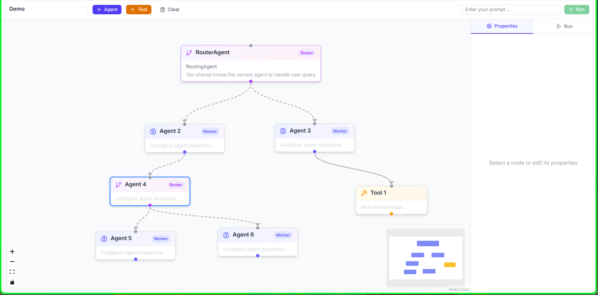
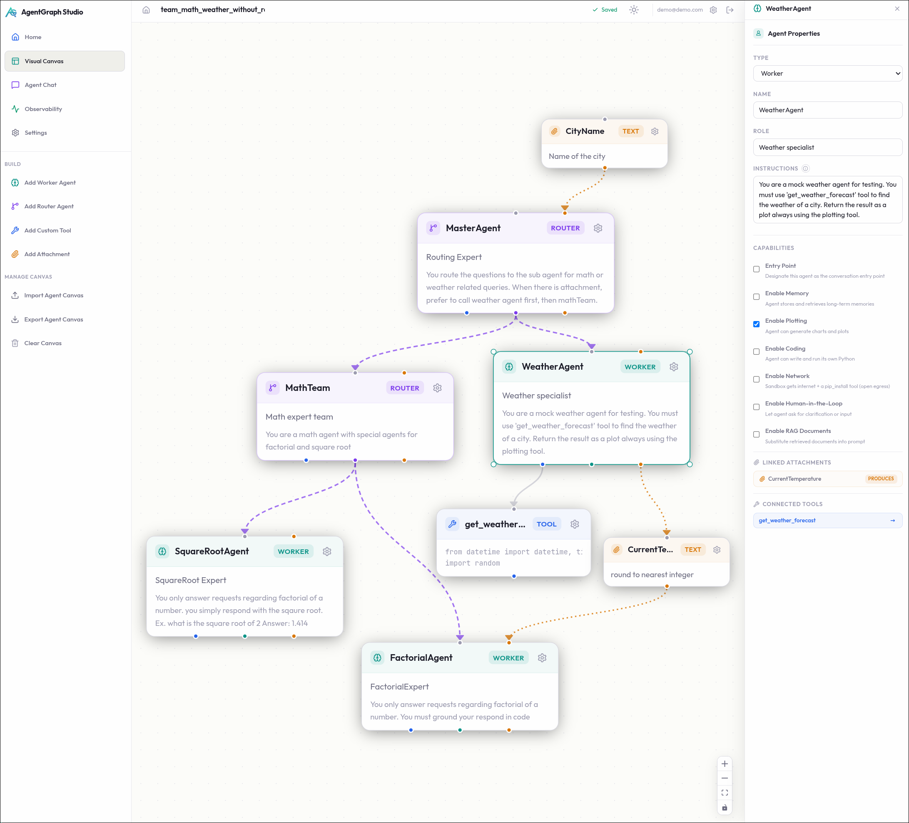
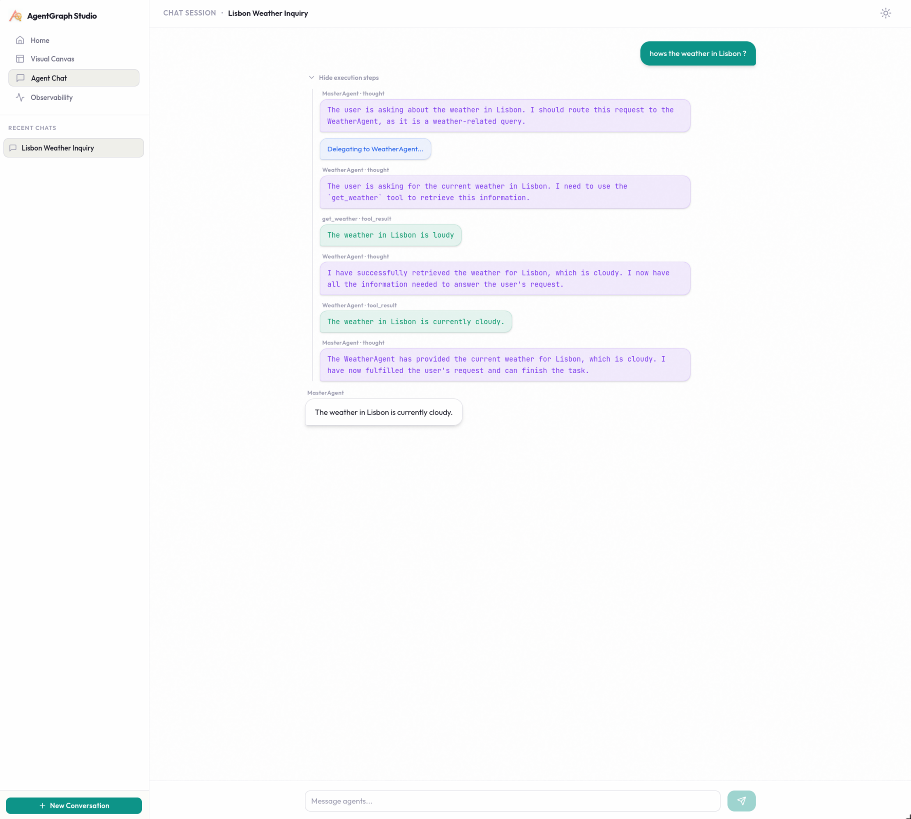

<h1 align="center">
  
  
  <br/>
  AgentGraph Studio
</h1>

<p align="center">
  <strong>The Visual IDE for Multi-Agent AI Workflows</strong>
</p>

<p align="center">
  <a href="https://react.dev/"></a>
  <a href="https://fastapi.tiangolo.com/"></a>
  <a href="https://dspy.ai/"></a>
  <a href="https://www.postgresql.org/"></a>
  <a href="https://github.com/dreadnode/llm-sandbox"></a>
</p>

<p align="center">
  AgentGraph Studio is a next-generation visual IDE designed to build, test, and run complex multi-agent AI networks. Wire worker and router nodes on a beautiful ReactFlow canvas, write custom Python tools that execute securely in a WASM sandbox, attach local document resources for in-memory RAG, and interact with your creation in a real-time streaming chat.
</p>

<p align="center">
  
</p>

<p align="center">
  
  
</p>

---

## 🗺️ Execution Flow

Here is how user prompts trigger visual tool execution, state progression, and real-time streaming:

```mermaid
graph TD
    classDef frontend fill:#3b82f6,stroke:#1d4ed8,stroke-width:2px,color:#fff;
    classDef backend fill:#10b981,stroke:#047857,stroke-width:2px,color:#fff;
    classDef storage fill:#8b5cf6,stroke:#6d28d9,stroke-width:2px,color:#fff;
    classDef sandbox fill:#f59e0b,stroke:#d97706,stroke-width:2px,color:#fff;

    A[React Canvas / Chat UI]:::frontend -->|1. WebSocket Connection| B[FastAPI ws/conversations/{id}/run]:::backend
    B -->|2. Load Canvas Graph| C[(PostgreSQL + pgvector)]:::storage
    B -->|3. Initialize Runner| D[CanvasRunner]:::backend
    D -->|4. Lazy Compilation & Setup| E[Build Worker/Router Agents]:::backend
    E -->|5. Sandboxed Tool Execution| F[Docker Sandbox / llm-sandbox]:::sandbox
    E -->|6. Multi-turn Agent Logic| G[DSPy StreamingReAct Loop]:::backend
    G -->|7. Embeddings / RAG / Memory| H[(mem0 + Qdrant)]:::storage
    G -->|8. Log Traces & Metrics| I[MLflow Tracing]:::storage
    G -->|9. Real-time Event Stream| A
```

---

## ✨ Features

*   **🎨 Visual Canvas Editor**: Build architectures using ReactFlow v12. Drag, configure, and wire agents and tools. Custom edges support smooth handoffs and distinct tool-access channels.
*   **🧠 Dual Agent Model**:
    *   **Workers**: Execute specialized tasks via DSPy ReAct loops (thoughts $\rightarrow$ tool calls $\rightarrow$ observations $\rightarrow$ answer).
    *   **Routers**: Orchestrate tasks by dynamically delegating execution to other worker or router nodes using lazy handoff tools.
*   **🛡️ Secure Docker Sandbox**: Execute user-defined Python tools safely inside isolated Docker containers managed by the `llm-sandbox` library. Provides OS-level isolation, native Python performance, and persistent session state across runs.
*   **📚 In-Memory RAG**: Attach domain-specific text documents directly to worker nodes. Documents are split using a paragraph-aligned chunker, embedded dynamically, and retrieved at runtime using the `{{ rag_document }}` template placeholder.
*   **💾 Agent Memory (mem0 + Qdrant)**: Maintain context across messages. Leverages a thread-safe, in-process shared `mem0` instance connected to a local Qdrant vector store.
*   ** WebSocket Streaming**: Watch thoughts, tool starts, tool results, handoffs, and final answers stream live. Canvas nodes glow green dynamically as they trigger.
*   **📦 Portable ZIP Packages**: Export an entire canvas (layout, agent states, tool scripts, and attached RAG documents) as a single portable `.zip` bundle, or import it back to share it.
*   **📈 MLflow Observability**: Full execution transparency. Automatically trace DSPy pipelines, LLM prompt signatures, and tool outputs using integrated MLflow tracking.
*   **🏷️ Automatic Conversation Naming**: Automatically titles new threads using a quick LLM call on the first message, with a fallback to the user's initial prompt.

---

## 📖 Documentation Directory

| File / Folder | Purpose |
| :--- | :--- |
| 📘 **[CLAUDE.md](./CLAUDE.md)** | Developer context — file layout, execution flow, change recipes, and TDD guidelines. |
| 🏛️ **[docs/ARCHITECTURE.md](./docs/ARCHITECTURE.md)** | Core architecture — schemas, REST / WS protocols, backend architecture, and design decisions. |
| 📖 **[CONTEXT.md](./CONTEXT.md)** | Glossary defining domain terminology (Canvas, Workers, Routers, Sandboxing, turns). |
| 🛠️ **[DEVELOPMENT.md](./DEVELOPMENT.md)** | Step-by-step checklists for cross-stack modifications (adding nodes, routes, events). |

<details>
<summary>📂 <strong>View Repository Directory Map</strong></summary>

```
mj-agent-framework/
├── backend/                  # FastAPI + DSPy execution backend
│   ├── src/canvas_server/
│   │   ├── runner/           # Core execution engine (CanvasRunner, RAG, factory)
│   │   ├── models/           # SQLAlchemy DB & API models
│   │   ├── routes/           # REST routers & WebSocket execution channels
│   │   └── sandbox.py        # Docker container sandbox (llm-sandbox)
│   └── tests/                # Comprehensive test suite (pytest)
├── frontend/                 # React 19 + Vite dashboard and workspace editor
│   ├── src/
│   │   ├── components/       # ReactFlow CanvasView, AgentNode, ToolNode, ChatPage
│   │   ├── store/            # Canvas & theme state management (zustand)
│   │   └── styles/globals.css# Design system, themes, and glow animations
│   └── e2e/                  # Playwright browser automation tests
└── docs/                     # Architecture sheets, screenshots, and ADRs
```
</details>

---

## ⚡ Quick Start (With Docker)

The fastest way to spin up pgvector, PostgreSQL, MLflow, the backend server, and the frontend app.

```bash
# Start docker containers (excluding Ollama by default)
make up

# Or start including Ollama via the GPU profile
make up-gpu
```

Once running, access the interfaces at:
*   **Frontend Studio**: `http://localhost:5173`
*   **FastAPI Backend**: `http://localhost:8000/docs`
*   **MLflow Observability**: `http://localhost:5000`

### Docker Makefile Commands

| Command | Action |
| :--- | :--- |
| `make up` | Run all stack services (Postgres, backend, frontend, mlflow) without Ollama. |
| `make up-gpu` | Run all stack services including local Ollama GPU container. |
| `make down` | Stop container services while preserving volume data. |
| `make down-v` | Stop container services and purge PostgreSQL/MLflow volumes. |
| `make clean-sandbox` | Clean up leftover temporary python sandbox environments. |

> [!NOTE]
> The setup defaults to an Ollama server running on the host machine (`http://192.168.1.120:11434`). Configure your local network or keys inside `backend/.env`.

---

## 🛠️ Local Installation (Without Docker)

### 1. Database Setup
Requires PostgreSQL 17 with the `pgvector` extension running on localhost:5432:
```bash
createdb canvas_db
```
*Alternatively, you can test locally using SQLite by modifying your config to `DATABASE_URL=sqlite+aiosqlite:///dev.db`.*

### 2. Backend Startup
Ensure you have Docker installed and running on your system to run the secure Python tool sandbox.
```bash
cd backend
python -m venv .venv && source .venv/bin/activate
pip install uv && uv sync
uv run alembic upgrade head
uv run uvicorn canvas_server.main:app --reload
```

### 3. Frontend Startup
```bash
cd frontend
npm install
npm run dev
```

---

## ⚙️ Configuration Variables

Create a `backend/.env` file. Refer to `backend/.env.example` for templated setups:

| Variable | Default Value | Description |
| :--- | :--- | :--- |
| `DATABASE_URL` | `postgresql+asyncpg://...` | Database connection string. |
| `LLM_BASE_URL` | `http://192.168.1.120:11434` | Ollama or provider LLM endpoint. |
| `LLM_MODEL` | `ollama_chat/gemma4:31b` | Default inference LLM model for agents. |
| `MEM0_PROVIDER` | `ollama` | Provider for memory indexing (`ollama`, `openai`). |
| `MEM0_LLM_MODEL` | `gemma4:31b` | Model used by the memory provider. |
| `MEM0_EMBEDDER_MODEL`| `nomic-embed-text` | Embedding model for memory and RAG. |
| `MEM0_EMBEDDER_DIMENSIONS`| `768` | Dimension count for embedding vector space. |
| `MLFLOW_TRACKING_URI`| `http://mlflow:5000` | MLflow host tracking endpoint. |
| `MLFLOW_ENABLED` | `true` | Enables or disables DSPy trace logging. |

> [!WARNING]
> Local Qdrant directories are not safe for concurrent multi-process file writing. The backend coordinates reads and writes through an in-process memory singleton to avoid file locking conflicts.

---

## 🧪 Testing Suites

Development is driven by **Test-Driven Development (TDD)**. Ensure all unit and integration tests run successfully:

### Backend Testing
```bash
cd backend
uv run pytest -v

# Run RAG & canvas-specific ZIP import/export tests
uv run python -m pytest tests/test_routes_canvas.py -q
```

### Frontend Testing
```bash
cd frontend
npx vitest run                  # Run components unit test suite
npx vitest run --coverage       # Check local line/branch coverage
npx tsc --noEmit                # Perform TypeScript checks
```

### Playwright E2E Integration Testing
```bash
cd frontend
npm run test:e2e
```
