AgentGraph Studio is a visual IDE for designing, saving, and running multi-agent workflows. 
Users build a canvas in the React frontend, save it through the API, then chat with a conversation to start or reconnect to a durable run. 
The backend worker coordinates the canvas runner, which executes agent/tool workflows and streams events back to chat. 

```mermaid
flowchart TD

subgraph group_frontend["Frontend workspace"]
  node_canvas_ui["Canvas editor<br/>[CanvasView.tsx]"]
  node_chat_ui["Chat and streaming<br/>[ChatPage.tsx]"]
  node_chat_ws["Chat WebSocket"]
  node_frontend_api["API client<br/>[api.ts]"]
  node_canvas_save["Canvas persistence"]
  node_observability_ui["Observability view"]
end

subgraph group_api["API and persistence"]
  node_canvas_routes["Canvas routes<br/>[canvas.py]"]
  node_execute_routes["Execution routes<br/>[execute.py]"]
  node_canvas_repo["Canvas repository<br/>[canvas_repo.py]"]
  node_run_repo["Durable run repository"]
  node_postgres[("PostgreSQL<br/>[database.py]")]
  node_zip_packages["Canvas and conversation ZIP<br/>[package_manager.py]"]
end

subgraph group_execution["Run execution"]
  node_worker["Background run worker"]
  node_coordinator["Run coordinator"]
  node_runner["Canvas runner<br/>[runner.py]"]
  node_react_loop["Agent reasoning loop<br/>[streaming_react.py]"]
end

subgraph group_integrations["Execution integrations"]
  node_sandbox["Docker tool sandbox<br/>[sandbox.py]"]
  node_rag["Document RAG<br/>[rag_helper.py]"]
  node_memory["Agent memory<br/>[memory.py]"]
  node_mlflow["MLflow tracing<br/>[tracing.py]"]
end

subgraph group_account["Accounts and settings"]
  node_auth_ui["Authentication UI<br/>[LoginPage.tsx]"]
  node_auth_routes["Authentication routes<br/>[auth.py]"]
  node_settings_routes["Provider settings<br/>[settings.py]"]
end

node_user(("User"))

node_user -->|"designs workflow"| node_canvas_ui
node_user -->|"sends prompts"| node_chat_ui
node_canvas_ui -->|"saves graph"| node_canvas_save
node_canvas_save -->|"encodes and submits"| node_frontend_api
node_frontend_api -->|"calls canvas API"| node_canvas_routes
node_canvas_routes -->|"reads and writes"| node_canvas_repo
node_canvas_repo -->|"persists canvas"| node_postgres
node_chat_ui -->|"manages conversation"| node_chat_ws
node_chat_ws -->|"starts and reconnects"| node_frontend_api
node_frontend_api -->|"calls run API"| node_execute_routes
node_execute_routes -->|"creates or retrieves run"| node_run_repo
node_execute_routes -->|"kicks and subscribes"| node_worker
node_run_repo -->|"persists run state"| node_postgres
node_worker -->|"claims and records events"| node_run_repo
node_worker -->|"delegates execution"| node_coordinator
node_coordinator -->|"initializes runner"| node_runner
node_runner -->|"runs agent turns"| node_react_loop
node_runner -->|"executes tools"| node_sandbox
node_react_loop -->|"retrieves documents"| node_rag
node_react_loop -->|"uses agent memory"| node_memory
node_react_loop -.->|"records traces"| node_mlflow
node_worker -->|"publishes run events"| node_chat_ws
node_chat_ws -->|"renders streamed events"| node_chat_ui
node_user -->|"authenticates"| node_auth_ui
node_auth_ui -->|"requests session"| node_frontend_api
node_frontend_api -->|"calls auth API"| node_auth_routes
node_auth_routes -->|"stores sessions"| node_postgres
node_frontend_api -->|"configures providers"| node_settings_routes
node_canvas_ui -.->|"imports and exports canvas"| node_zip_packages
node_chat_ui -.->|"imports and exports conversations"| node_zip_packages
node_observability_ui -.->|"loads run observability"| node_frontend_api

click node_canvas_ui "https://github.com/manojmanivannan/agentgraphstudio/blob/main/frontend/src/components/canvas/CanvasView.tsx"
click node_chat_ui "https://github.com/manojmanivannan/agentgraphstudio/blob/main/frontend/src/components/chat/ChatPage.tsx"
click node_chat_ws "https://github.com/manojmanivannan/agentgraphstudio/blob/main/frontend/src/components/chat/useChatWebSocket.ts"
click node_frontend_api "https://github.com/manojmanivannan/agentgraphstudio/blob/main/frontend/src/lib/api.ts"
click node_canvas_save "https://github.com/manojmanivannan/agentgraphstudio/blob/main/frontend/src/hooks/useCanvasPersistence.ts"
click node_canvas_routes "https://github.com/manojmanivannan/agentgraphstudio/blob/main/backend/src/canvas_server/routes/canvas.py"
click node_execute_routes "https://github.com/manojmanivannan/agentgraphstudio/blob/main/backend/src/canvas_server/routes/execute.py"
click node_canvas_repo "https://github.com/manojmanivannan/agentgraphstudio/blob/main/backend/src/canvas_server/repos/canvas_repo.py"
click node_run_repo "https://github.com/manojmanivannan/agentgraphstudio/blob/main/backend/src/canvas_server/repos/durable_run_repo.py"
click node_postgres "https://github.com/manojmanivannan/agentgraphstudio/blob/main/backend/src/canvas_server/database.py"
click node_worker "https://github.com/manojmanivannan/agentgraphstudio/blob/main/backend/src/canvas_server/background_run_worker.py"
click node_coordinator "https://github.com/manojmanivannan/agentgraphstudio/blob/main/backend/src/canvas_server/conversation_run_coordinator.py"
click node_runner "https://github.com/manojmanivannan/agentgraphstudio/blob/main/backend/src/canvas_server/runner/runner.py"
click node_react_loop "https://github.com/manojmanivannan/agentgraphstudio/blob/main/backend/src/canvas_server/streaming_react.py"
click node_sandbox "https://github.com/manojmanivannan/agentgraphstudio/blob/main/backend/src/canvas_server/sandbox.py"
click node_rag "https://github.com/manojmanivannan/agentgraphstudio/blob/main/backend/src/canvas_server/runner/rag_helper.py"
click node_memory "https://github.com/manojmanivannan/agentgraphstudio/blob/main/backend/src/canvas_server/runner/memory.py"
click node_mlflow "https://github.com/manojmanivannan/agentgraphstudio/blob/main/backend/src/canvas_server/runner/tracing.py"
click node_auth_ui "https://github.com/manojmanivannan/agentgraphstudio/blob/main/frontend/src/components/auth/LoginPage.tsx"
click node_auth_routes "https://github.com/manojmanivannan/agentgraphstudio/blob/main/backend/src/canvas_server/routes/auth.py"
click node_settings_routes "https://github.com/manojmanivannan/agentgraphstudio/blob/main/backend/src/canvas_server/routes/settings.py"
click node_zip_packages "https://github.com/manojmanivannan/agentgraphstudio/blob/main/backend/src/canvas_server/package_manager.py"
click node_observability_ui "https://github.com/manojmanivannan/agentgraphstudio/blob/main/frontend/src/components/observability/ObservabilityPage.tsx"

classDef toneNeutral fill:#f8fafc,stroke:#334155,stroke-width:1.5px,color:#0f172a
classDef toneBlue fill:#dbeafe,stroke:#2563eb,stroke-width:1.5px,color:#172554
classDef toneAmber fill:#fef3c7,stroke:#d97706,stroke-width:1.5px,color:#78350f
classDef toneMint fill:#dcfce7,stroke:#16a34a,stroke-width:1.5px,color:#14532d
classDef toneRose fill:#ffe4e6,stroke:#e11d48,stroke-width:1.5px,color:#881337
classDef toneIndigo fill:#e0e7ff,stroke:#4f46e5,stroke-width:1.5px,color:#312e81
classDef toneTeal fill:#ccfbf1,stroke:#0f766e,stroke-width:1.5px,color:#134e4a
class node_canvas_ui,node_chat_ui,node_chat_ws,node_frontend_api,node_canvas_save,node_observability_ui,node_user toneBlue
class node_canvas_routes,node_execute_routes,node_canvas_repo,node_run_repo,node_postgres,node_zip_packages toneAmber
class node_worker,node_coordinator,node_runner,node_react_loop toneMint
class node_sandbox,node_rag,node_memory,node_mlflow toneRose
class node_auth_ui,node_auth_routes,node_settings_routes toneIndigo
```

