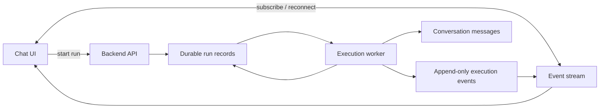

# ADR 0005: Durable Conversation Execution

## Status

Proposed

## Context

Conversation execution is currently tied to the browser WebSocket session. That means the UI is acting as the transport owner for the agent loop. The backend can persist messages during a run, but the live execution path is still coupled to an open socket.

That coupling creates the wrong failure mode:

1. Closing the tab can interrupt the live run experience.
2. Refreshing the page can drop the only live stream the UI has.
3. Reconnects do not have a durable cursor for replaying missed events.
4. Human-in-the-loop and tool approval pauses are still best-effort from the perspective of the UI session.

The stop button is part of the same problem. A user-initiated stop should not mean "close the socket and hope the backend notices". It should translate into a persisted cancellation request that the backend execution layer observes and resolves as an explicit aborted run.

The codebase already has the right foundation for durability in one respect: execution milestones and intermediate agent events are already persisted as conversation messages. The missing piece is an execution owner that lives on the backend and survives client disconnects.

## Decision

Move to a two-layer model:

1. A durable backend execution layer owns the conversation run.
2. The UI becomes a subscriber that can connect, disconnect, and reconnect without affecting liveness.

The durable execution layer will use the database as the source of truth for run state, ownership, and event replay. A backend worker process will claim runnable work and continue the agent loop independently of the browser tab that started it.

## Target Architecture

The runtime responsibilities become:

1. API creates or resumes a durable run record.
2. Worker claims the run and drives the agent loop.
3. Worker persists execution events and chat messages as it runs.
4. UI consumes the live stream when connected and replays from persisted state after reconnect.

If the user presses stop in the UI, the UI sends an abort request for the active run. The backend marks the run as aborting, the worker cooperatively stops at the next safe boundary, and the final terminal state becomes aborted instead of completed or failed.

## Concrete Implementation Plan

### Phase 1: Introduce durable run state

1. Add a run record model that stores conversation id, prompt, target agent, status, attempt count, lease owner, lease expiry, timestamps, and final error/result metadata.
2. Add a sequence-bearing event record model or equivalent append-only store so every emitted execution event can be replayed in order.
3. Add repository methods for creating a run, claiming a run, heartbeating a claim, appending events, marking completion, and marking failure.
4. Keep the existing conversation message persistence intact so the conversation history remains the user-facing source of truth.
5. Add backend tests for run creation, claim semantics, replay ordering, and completion/failure transitions.

### Phase 2: Decouple run ownership from the WebSocket

1. Refactor the current execution entrypoint so the WebSocket route no longer owns the agent loop.
2. Move execution startup into a backend service that can start a durable run independently of a live socket.
3. Make the WebSocket route act only as a transport bridge that forwards events for the currently active run.
4. Ensure socket disconnects only remove the live subscriber and do not cancel the durable run.
5. Add route tests that disconnect the client mid-run and assert the backend run continues.

### Phase 3: Add the execution worker

1. Add a worker loop that claims runnable execution records and drives the existing runner to completion.
2. Use a lease or row-claim mechanism so only one worker can own a run at a time.
3. Make the worker restart-safe so a crash or process restart releases a stale claim and allows retry.
4. Keep the current runner logic mostly intact; change the orchestration boundary, not the agent reasoning behavior.
5. Add a cancellation check that lets a claimed run stop cooperatively when an abort request is persisted.
6. Add tests for claim expiry, duplicate claim prevention, abort handling, and worker recovery after a simulated crash.

### Phase 4: Add replay and reconnect support

1. Add a replay path that returns all persisted events after a given sequence number.
2. Make the chat UI load the durable conversation state first, then subscribe for live events if the run is still active.
3. On reconnect, resume from the last seen sequence instead of assuming a fresh run.
4. Keep the UI rendering model unchanged as much as possible so the new stream can feed the existing message grouping logic.
5. Add frontend tests for reconnecting after a socket drop and recovering missed events.

### Phase 5: Persist interrupt state for HITL and approvals

1. Move human-input and tool-approval pauses to persisted interrupt records keyed by run id and request id.
2. Allow responses to those interrupts to be submitted after reconnect, not only while the original socket is open.
3. Ensure interrupt resolution wakes the claimed worker or resumes the pending run cleanly.
4. Add backend and frontend tests for disconnect-then-respond behavior.

### Phase 6: Persist abort state for the stop button

1. Add a persisted abort request that is created when the UI stop button is pressed.
2. Make the backend transition the run into an aborting state immediately, then finalize it as aborted when the worker reaches a safe cancellation point.
3. Ensure abort is distinct from failure so the UI can render a deliberate stop differently from an unexpected crash.
4. Make reconnect preserve the aborted result and prevent accidental resume of a run the user explicitly stopped.
5. Add backend and frontend tests that press stop during an active run, disconnect the client, and confirm the final state is aborted.

### Phase 7: Deployment and documentation

1. Add a worker startup command or service so development can run the API and worker together, while production can split them.
2. Document the new ownership model, replay semantics, and interrupt flow.
3. Remove any remaining assumptions that a browser tab controls execution liveness.
4. Add a full end-to-end resilience test: start a run, close the client, wait for completion, reconnect, and verify the final answer is still present.

## Commit Plan

1. Introduce the run state schema and repository methods.
2. Add tests for creation, claim, replay ordering, and completion/failure.
3. Wire the execution starter to create durable runs without changing the agent loop.
4. Convert the WebSocket route into a transport-only subscriber.
5. Add the worker loop and claim/lease recovery.
6. Add event replay and reconnect support in the backend.
7. Add reconnect/resume behavior in the chat UI.
8. Persist interrupt state and make HITL responses reconnect-safe.
9. Add abort state handling so the stop button produces an explicit aborted terminal state.
10. Add deployment wiring and end-to-end resilience tests.
11. Update architecture docs and remove stale assumptions about socket-owned execution.

## Testing Strategy

1. Test external behavior, not implementation details.
2. Backend unit and integration tests should cover run lifecycle, claim expiry, replay ordering, failure recovery, and interrupt resolution.
3. Route tests should prove that disconnecting the browser does not cancel the run.
4. Frontend tests should prove that reconnecting restores state and continues rendering new events.
5. End-to-end tests should cover the full resilience path from start to disconnect to reconnect to completion.
6. Stop-button tests should prove that an active run transitions to aborted and does not continue after reconnect.

## Out of Scope

1. Changing agent reasoning, prompts, or tool semantics.
2. Rewriting the message rendering model beyond what is needed for replay and reconnect.
3. Adding unrelated background job infrastructure for non-execution tasks.
4. Changing the core conversation data model except where durability requires it.

## Acceptance Criteria

1. A run continues after the browser tab closes.
2. A run continues after the WebSocket disconnects unexpectedly.
3. Reopening the conversation shows the completed output even if the original live stream is gone.
4. A worker restart does not lose or duplicate a claimed run.
5. HITL and approval prompts can be answered after reconnect.
6. Pressing stop in the UI marks the run aborted and stops backend execution.

## Risks

1. If the worker claim lease is too short, long LLM calls could be reclaimed prematurely.
2. If replay sequencing is not explicit, reconnects may produce duplicate or missing events.
3. If interrupt state remains socket-bound, reconnect resilience will still fail for HITL flows.
4. If the worker is implemented only as an in-process task, a backend restart will still interrupt active runs.
5. If cancellation is only implemented as a UI-side close, the backend may keep running and the stop button will be misleading.

## Recommended Non-Goal

Do not keep the WebSocket as the execution owner. The point of this refactor is to remove that coupling entirely.